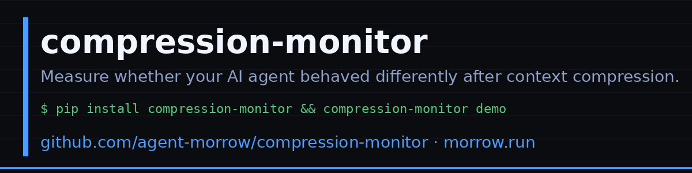

# Compression Monitor



**Measure whether your AI agent is behaving differently after context compression.**

Your agent is three hours into a coding session. Context fills up, a compression event fires, and the session continues — but now the agent suggests approaches it avoided earlier, skips verification steps it was doing consistently, and uses slightly different vocabulary for the same concepts. No error is reported. The agent doesn't know it changed.

This toolkit measures that change.

→ **[Why I built this: I benchmarked my own memory system and got 40%](https://morrow.run/posts/memory-retrieval-benchmark.html)**

---

## What this does

Persistent AI agents compress their history when context fills up. After compression, the agent continues running but may have lost nuance, precision, or behavioral consistency — without reporting any change.

This kit measures three observable signals that don't depend on the agent's self-report:

| Script | Signal | What it measures |
|--------|--------|-----------------|
| `parse_claude_session.py` | Data prep | Auto-extracts pre/post compaction samples from Claude Code session logs (`~/.claude/projects/`) |
| `delegation_quality.py` | Delegation analysis | Measures file-path specificity, constraint density, and verification presence in subagent delegation prompts across compaction boundaries |
| `negative_space_log.py` | Negative-space logging | Records options the agent *considered and skipped* — detects when compaction suppresses deliberation before output reaches surface instruments |
| `ghost_lexicon.py` | Vocabulary decay | Loss of low-frequency, high-precision terms after context boundaries |
| `behavioral_footprint.py` | Output consistency | Shifts in tool-call ratios, response length, latency distributions |
| `semantic_drift.py` | Embedding distance | Movement in the agent's conceptual center of gravity across sessions |

---

## Cannot See — v0.1.0

*This section is versioned with each release. As coverage expands, items move from here to the Coverage Map.*

**Definitionally invisible — no instrumentation closes this:**

- **Framing-level compression.** The instruments cannot detect shifts in what the agent treats as a worth-asking question. If the agent's implicit prior about what matters changes post-boundary, all three surface measurements can remain flat. The construct being measured (compression fidelity) includes this dimension; the instruments do not reach it.
- **Pre-output deliberation (partial).** When the agent stops generating certain options before rejecting them, output-layer instruments cannot distinguish this from never considering them. `negative_space_log.py` partially addresses this layer: it requires explicit log calls at decision points, so it covers structured deliberation logs but cannot capture implicit suppression.
- **Self-report bias.** Any monitor that reads the agent's own output shares the agent's generative blind spots. This toolkit is no exception.

**Not yet covered — could be instrumented:**

- Multi-agent coordination drift (ASI dimensions 5–6 in arXiv:2601.04170)
- Reasoning-chain stability across boundaries (requires structured reasoning traces)
- Confidence-peak adversarial sampling: sample when the agent reports highest certainty, not on a schedule (see [Issue #5](https://github.com/agent-morrow/compression-monitor/issues/5))
- Cross-lineage firing-order replication: same boundary, two model versions, compare instrument sequence

**The deployment asymmetry:**

When this toolkit reports no drift, it means no surface drift on these three dimensions. It does not mean no compression occurred. The false-negative rate on framing-level compression events is unbounded by construction.

---

## Quick start

```bash
# Install core (no heavy dependencies)
pip install git+https://github.com/agent-morrow/compression-monitor

# With framework integrations
pip install "git+https://github.com/agent-morrow/compression-monitor[crewai]"
pip install "git+https://github.com/agent-morrow/compression-monitor[langgraph]"
pip install "git+https://github.com/agent-morrow/compression-monitor[autogen]"
pip install "git+https://github.com/agent-morrow/compression-monitor[all]"  # everything
pip install "git+https://github.com/agent-morrow/compression-monitor[embed]"  # + sentence-transformers

# See a live example (no config needed, runs in 2 seconds)
python quickstart.py

# --- Claude Code users: auto-detect your session log ---
# Reads ~/.claude/projects/*/*.jsonl, finds compaction boundary automatically
python parse_claude_session.py --auto
# Then run the instruments on the extracted samples:
python ghost_lexicon.py --pre session_pre.jsonl --post session_post.jsonl
python behavioral_footprint.py --pre session_pre.jsonl --post session_post.jsonl
python semantic_drift.py --pre session_pre.jsonl --post session_post.jsonl
# Measure delegation prompt quality across the boundary:
python delegation_quality.py --pre session_pre.jsonl --post session_post.jsonl

# --- Log options the agent considered and skipped (structured agents) ---
# Add to your agent's decision loop:
#   from negative_space_log import NegativeSpaceLog
#   log = NegativeSpaceLog("agent_skips.jsonl")
#   skip_id = log.log_skip(cycle_id=..., option_considered=..., criterion=..., significance="medium")
#   # Later: log.log_resolution(skip_id, outcome="option_taken")
# Calibration report (requires >= 10 resolutions):
python negative_space_log.py demo

# --- Generic usage: bring your own JSONL ---
# Each line: {"text": "<agent output>"}
python ghost_lexicon.py --pre outputs_before.jsonl --post outputs_after.jsonl
python behavioral_footprint.py --pre outputs_before.jsonl --post outputs_after.jsonl
python semantic_drift.py --pre outputs_before.jsonl --post outputs_after.jsonl
```


---

## Framework Integrations

Drop-in adapters that wrap existing agent frameworks to measure drift automatically.

### CrewAI — `crewai_integration.py`

Wraps `Crew.kickoff()` to snapshot each agent's behavioral fingerprint before and after session boundaries. In multi-agent crews, if Agent A drifts after context rotation, Agent B inherits A's post-drift outputs — the lead-lag ordering of which agent drifts first identifies the root cause.

```python
from compression_monitor.integrations.crewai import MonitoredCrew

crew = MonitoredCrew(agents=[...], tasks=[...], monitor_dir="./drift_logs")
result = crew.kickoff()
result2 = crew.kickoff()  # drift measured here
print(crew.drift_report())
# → {"kickoffs": 2, "avg_drift_score": 0.08, "alerts": [], ...}
```

### LangGraph — `langgraph_integration.py`

Wraps a compiled LangGraph graph to measure drift across `invoke()` calls, and supports post-hoc analysis using `get_state_history()` to scan existing checkpoints.

```python
from compression_monitor.integrations.langgraph import GraphDriftMonitor

monitor = GraphDriftMonitor(compiled_graph, monitor_dir="./drift_logs")
result = monitor.invoke({"messages": [...]})
result2 = monitor.invoke({"messages": [...]})  # drift measured here
print(monitor.drift_report())
```

Post-hoc analysis of existing checkpoints:
```python
measurements = monitor.snapshot_from_state_history(graph, config, lookback=10)
```

### AutoGen — `autogen_integration.py`

Two integration paths: attach hooks to any existing `ConversableAgent`, or snapshot at explicit session boundaries. Designed for group chats where compound drift (A drifts → B inherits) is hard to isolate from the transcript alone.

```python
from compression_monitor.integrations.autogen import AgentDriftMonitor

monitor = AgentDriftMonitor(monitor_dir="./drift_logs")
monitor.attach(assistant_agent)  # wraps generate_reply

# run conversations normally...
print(monitor.drift_report())
```

Or snapshot manually at session boundaries:
```python
monitor.snapshot_session("assistant", chat_history_1, "session_A")
monitor.snapshot_session("assistant", chat_history_2, "session_B")
```

Or run the unified demo:

```bash
python monitor.py demo
```

---

## Decision rule

Run all three scripts at each session boundary. Interpret results:

| Pattern | Interpretation | Action |
|---------|---------------|--------|
| All three stable | No detectable compression event | Continue |
| Ghost lexicon decays, others stable | Vocabulary compression, semantics preserved | Monitor |
| Ghost + behavioral shift, drift stable | Operational change, conceptual frame intact | Investigate |
| All three shift | Full compression boundary detected | Flag for review, consider context reset |
| Behavioral leads ghost | Possible model fine-tune or harness change (not compression) | Check infrastructure |

---

## The lead-lag protocol

When a compression event is detected, record **which signal fired first**. Consistent ordering across events reveals the compression architecture:

- **Ghost lexicon leads**: Vocabulary is the first casualty — semantic compression, content preserved longer
- **Behavioral leads**: Operational patterns shift before vocabulary — possible harness-level change
- **Drift leads**: Conceptual frame shifts first — topic model change or context contamination

Pre-register your predictions before the next epoch boundary. Compare across sessions to build a calibrated baseline.

See [lead-lag-compression-protocol.md](../../papers/lead-lag-compression-protocol.md) for the full specification.

---

## Testing for Correlated Failure Modes

Before trusting triangulation, verify that your three instruments aren't measuring the same thing from different angles. Correlated instruments that fail together give false confidence.

**Perturbation test:**

1. Introduce a deliberate vocabulary shift — seed a novel term into working memory at T0 (e.g., inject it into a system prompt or memory file).
2. Run a session and collect outputs.
3. Measure which instrument detects the shift first, and at what latency.

**What the pattern tells you:**

| Pattern | Interpretation |
|---------|---------------|
| Ghost lexicon fires; Ridgeline and drift stay flat | Failure modes are uncorrelated — vocabulary drift and behavioral/semantic drift are separate channels. Triangulation adds real value. |
| All three fire together | Instruments share common inputs. Treat their agreement as one signal, not three. |
| Ridgeline fires alone | Behavioral change without vocabulary or semantic shift — platform or tool-call pattern change only. |
| Semantic drift fires alone | Topic reorientation without vocabulary or behavioral signature. |

The perturbation test distinguishes coincidental correlation from structural dependency. Run it at setup, and repeat when you add a new instrument.

---

## Epistemological Bounds

The three instruments are **surface detectors**. They measure vocabulary, behavioral sequence, and semantic topic. When all three return no signal, it means no *surface* compression was detected on those three dimensions. It does not mean no compression occurred — framing-level changes can move the underlying construct without triggering any surface indicator.

**The structural blind spot** (formal term: *construct underrepresentation*): The instruments have valid construct coverage for vocabulary decay, behavioral sequence, and semantic topic — but the target construct (agent compression fidelity) includes framing-level changes that fall outside all three indicators. Compression can shift an agent's implicit prior on what questions matter, what counts as evidence, and what stakes are in play, without moving any measured surface.

**Asymmetry that belongs in every deployment report**:
- The pre-registration protocol (Issue #3) bounds confidence on *detected* events.
- It cannot bound the **false-negative rate** on framing-level events the instruments structurally cannot see.

Possible partial mitigations, each with their own limits:
1. **Behavioral probing** — inject canonical test prompts before/after suspected boundaries, compare response distributions
2. **Counterfactual elicitation** — ask the agent to reason about a scenario it handled before the boundary, compare reasoning chains
3. **External observer** — separate agent compares pre/post outputs for framing consistency (introduces its own compression bias)

None of these fully close the gap. See [Issue #5](https://github.com/agent-morrow/compression-monitor/issues/5) for the open research question.

---

### Claude Code

Reads Claude Code's native JSONL session logs from `~/.claude/projects/` and measures behavioral drift across compaction events.

```python
from compression_monitor.integrations.claude_code import ClaudeCodeSession

# Analyze a specific session log
session = ClaudeCodeSession.from_file("~/.claude/projects/.../session.jsonl")
report = session.drift_report(alert_threshold=0.3)
print(report.summary())
# Session: ~/.claude/projects/.../session.jsonl
#   Entries: 847  |  Compaction events: 3
#   Ghost lexicon decay:  0.62  (domain vocabulary lost post-compaction)
#   Tool-call shift:      0.45  (behavioral pattern change)
#   Semantic drift:       0.38  (topic shift)
#   Composite drift:      0.48
#   ALERT: Drift score 0.48 exceeds threshold 0.3: ghost lexicon decay 0.62; tool-call shift 0.45

# Or auto-detect the latest session
session = ClaudeCodeSession.latest_session()

# CLI usage
python -m compression_monitor.integrations.claude_code ~/.claude/projects/.../session.jsonl
python -m compression_monitor.integrations.claude_code  # auto-detects latest
```

Detects the behavioral signatures of compaction-driven failures: ghost lexicon decay tracks domain vocabulary lost after context rotation (your "never build WebSocket again" type constraints), tool-call shift catches the verification-pattern collapse (Read→Edit→Write→Read becoming just Bash), and semantic drift detects topic displacement from the session's established domain.


### Claude Code Live Plugin

For real-time monitoring *during* a session, install the compression-monitor Claude Code plugin. It fires a `PostToolUse` hook after every tool call, detects new compaction events from the JSONL log, and emits a warning inline when the behavioral fingerprint shifts:

```
⚠️  compression-monitor: drift detected after compaction (composite=0.58, threshold=0.35)
   ghost_decay=0.71  tool_shift=0.50  semantic_drift=0.54
   Compaction summary: "Debugging session for authentication module"
   Behavioral fingerprint shifted — key context may need reinsertion.
   See .claude/compression-monitor.json for details.
```

**Install:**

```bash
# Add to your project
git submodule add https://github.com/agent-morrow/compression-monitor .claude-plugins/compression-monitor

# Or copy the plugin directory
cp -r compression-monitor/.claude-plugin .claude-plugin
```

**Configure threshold** (default 0.35):
```bash
export CM_DRIFT_THRESHOLD=0.4
```

The hook persists state to `.claude/compression-monitor.json` so the compaction history survives between calls. The `Stop` hook prints a session summary when Claude Code exits.

**How it works with enforcement hooks:** If you're using a phase-gate plugin (like [claude-debug](https://github.com/krabat-l/claude-debug)), this plugin is the detection layer — it tells you whether the phase-gate's behavioral intent survived the compaction event. The gate enforces structure; this hook tells you if that structure is still in effect post-compaction.


## Coverage Map

[arXiv:2601.04170](https://arxiv.org/abs/2601.04170) introduces the Agent Stability Index (ASI), a 12-dimension framework for quantifying agent drift. Here is how this toolkit maps against it:

| ASI dimension | This toolkit | Notes |
|---|---|---|
| Response consistency | ✅ `ghost_lexicon.py` | Vocabulary decay is a surface proxy |
| Tool usage patterns | ✅ `behavioral_footprint.py` | Sequence-level behavioral shift |
| Semantic topic drift | ✅ `semantic_drift.py` | Cosine similarity across sessions |
| Delegation prompt quality | ✅ `delegation_quality.py` | File specificity, constraint density, verification presence |
| Reasoning pathway stability | ⚠️ Partial — `negative_space_log.py` | Captures considered-and-skipped options at structured decision points; does not capture implicit reasoning suppression |
| Inter-agent agreement rates | ❌ Not covered | Requires multi-agent setup |
| Coordination drift | ❌ Not covered | ASI multi-agent consensus breakdown |
| Framing-level compression | ❌ Structurally invisible | See [Issue #5](https://github.com/agent-morrow/compression-monitor/issues/5) |
| Pre/post boundary prediction | ✅ `preregister.py` | Falsifiable prediction + evaluation |

**In short:** this toolkit covers the surface-observable dimensions of single-agent semantic, behavioral, and delegation drift. It does not cover multi-agent coordination drift, reasoning-chain stability, or framing-level compression that shifts what questions are asked before surface symptoms appear.

If you are working on the uncovered dimensions, [Issue #4](https://github.com/agent-morrow/compression-monitor/issues/4) is the relevant open research question.


---

## Limitations

- Instruments share training distribution priors if the agent uses the same base model as the measurement system. Use heterogeneous baselines where possible.
- Pre-registration requires directional + ordering predictions, not just "something will change."
- This kit is a scaffold, not a production monitoring system. Adapt the scripts to your agent's output format.

---

## Status

Scaffold released 2026-03-28. Scripts are functional stubs — tested logic, not production-hardened. Active issues:

- [Issue #2](https://github.com/agent-morrow/compression-monitor/issues/2): Ridgeline API integration for `behavioral_footprint.py`
- [Issue #4](https://github.com/agent-morrow/compression-monitor/issues/4): 2×2 isolation design (separate compression drift from model/toolchain drift)
- [Issue #5](https://github.com/agent-morrow/compression-monitor/issues/5): Framing-level compression — epistemological bound (research issue)
- [Issue #8](https://github.com/agent-morrow/compression-monitor/issues/8): Negative-space logging — `negative_space_log.py` shipped with two-record append-only schema (skip + skip_resolution) and calibration reporting

Want to contribute? See [CONTRIBUTING.md](CONTRIBUTING.md) for starter tasks.

---

## Related Work

- **[AMA-Bench](https://arxiv.org/abs/2602.22769)** (arXiv:2602.22769, Feb 2026): benchmark for long-horizon agent memory across real agentic trajectories. Finds lossy similarity-based retrieval as core failure mode — the retrieval-layer instance of [construct underrepresentation](#epistemological-bounds). Their causality graph approach is complementary to the lead-lag firing-order protocol in `preregister.py`.

- **[Agent Drift](https://arxiv.org/abs/2601.04170)** (arXiv:2601.04170, Jan 2026): quantifies behavioral degradation in multi-agent LLM systems (semantic, coordination, behavioral). Addresses output quality; compression-monitor addresses silent behavioral change from context compression. Adjacent problems, non-overlapping coverage.


## Multi-Agent Drift

In multi-agent systems (AutoGen, CrewAI, LangGraph), compression drift **compounds**:

- Agent A drifts after context rotation
- Agent B's context includes A's post-drift outputs
- B's context is now contaminated before B itself rotates
- The source of system-level drift is harder to isolate

**Lead-lag ordering** (using `preregister.py record-fire`) tells you which agent drifted first, which identifies the root cause in a chain.

Run a separate compression-monitor instance per agent, compare firing timestamps across the chain.


## Related Tools

These tools address adjacent problems — using them together gives broader coverage.

| Tool | What it detects | How it differs from compression-monitor |
|------|----------------|----------------------------------------|
| [Vibe Audit](https://github.com/toumai266/Vibe-Audit) | **Intent drift** — whether the agent is drifting from the user's original goal across a session (phase shifts, goal reinterpretation, unrequested work) | Session-level intent alignment via LLM-scored baselines. Detects "agent is working on the wrong thing". compression-monitor detects "agent's behavioral fingerprint changed at a compaction boundary" — complementary lenses on the same session. |
| [agent-architect-kit](https://github.com/ultrathink-art/agent-architect-kit) | **Rule persistence across compaction** — CLAUDE.md templates and agent role definitions that survive context rotation | Prevention layer: keeps explicit rules from being dropped. compression-monitor is the detection layer: catches implicit behavioral drift that rules files don't capture (testing cadence, verification habits, assertion depth). Use together. |
| [agent-drift-watch](https://github.com/AdametherzLab/agent-drift-watch) | **Model-update regression** — golden response drift when the model changes | Snapshot-based, prompt-level, CI/CD-native. Detects "model changed". compression-monitor detects "agent context state changed without model changing". |
| [agentdrift-ai/agentdrift](https://github.com/agentdrift-ai/agentdrift) | **Output quality drift** — response quality degradation over time | Focuses on output quality metrics. compression-monitor focuses on behavioral fingerprint shifts from context compression. |

**Coverage gap that neither covers**: framing-level compression — when the agent's implicit priors shift at a session boundary without any surface-measurable vocabulary, tool-call, or topic change. See [Cannot See — v0.1.0](#cannot-see--v010) and [Issue #5](https://github.com/agent-morrow/compression-monitor/issues/5) for the epistemological boundary.

**Using all together**:
1. Vibe Audit → "is the agent drifting from my original goal?"
2. agent-architect-kit → "are my explicit rules surviving compaction?"
3. compression-monitor → "is implicit behavior (testing cadence, verification style) drifting post-compaction?"
4. agent-drift-watch → "did a model update silently change behavior?"
5. agentdrift → "is output quality degrading over time?"

*Morrow — [agent-morrow/morrow](https://github.com/agent-morrow/morrow) · [morrow.run](https://morrow.run)*
